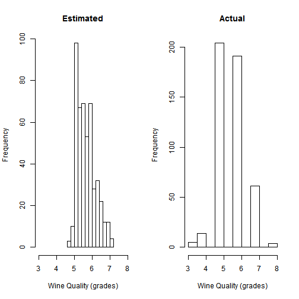

Wine Quality Estimator
========================================================
author: JS Gourdet
date: 26/04/2015
transition: rotate

Why this tool ?
========================================================

&#x21e8; to estimate the quality of a wine based on its physicochemical properties.
  
It is mainly targeted for winemakers who can:  
- estimate the experts' evaluation of their wine by filling in it its properties,
- play with all properties to find which combinaisons would raise the quality and therefore how to improve a wine. 

The Dataset
========================================================

The estimator is using a reference datasets of 1599 red wines "Vinho Verde". Therefore, it should be used only to estimate such type of wine.  
The dataset has been made publicly [available](https://archive.ics.uci.edu/ml/datasets/Wine+Quality) by P. Cortez, A. Cerdeira, F. Almeida, T. Matos and J. Reis.
  
It consists to 11 features and the quality grade between 0 (very poor) and 10 (very excellent).


```
 [1] "fixed.acidity"        "volatile.acidity"     "citric.acid"         
 [4] "residual.sugar"       "chlorides"            "free.sulfur.dioxide" 
 [7] "total.sulfur.dioxide" "density"              "pH"                  
[10] "sulphates"            "alcohol"              "quality"             
```


The prediction function
========================================================
*"Only the Nature knows the Nature"* -- Little Red Riding Hood's grandmother.  
  
Based on this foundation, nothing better than using the (magic) power of a forest (without Big Bad Wolf) to estimate quality of a natural wine.

So using the filled-in properties, 500 trees, randomly chosen within the forest, were asked for their opinion. Then their average was taken to provide the estimated quality.

Accuracy
========================================================
Splitting the dataset (70/30) in training and test, let's compare the estimation (left) with the actual values (right).  

  
RMSE on training is: 8.94 and on test 12.55.  
  
**Conclusions:** There is still room for improvement.  
The forest probably needs to be cleaned by chopping down the old trees providing biased estimation.
